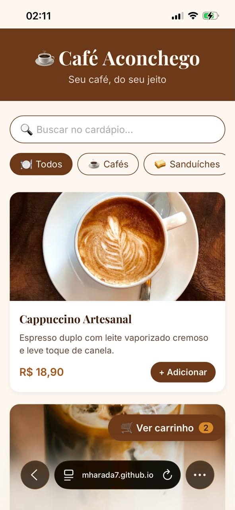
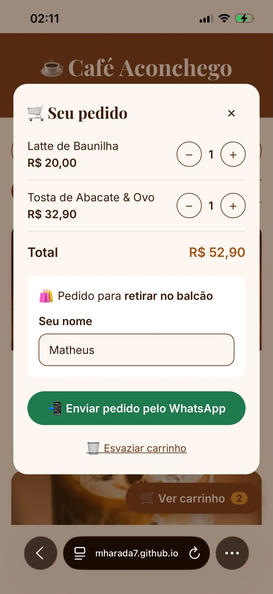
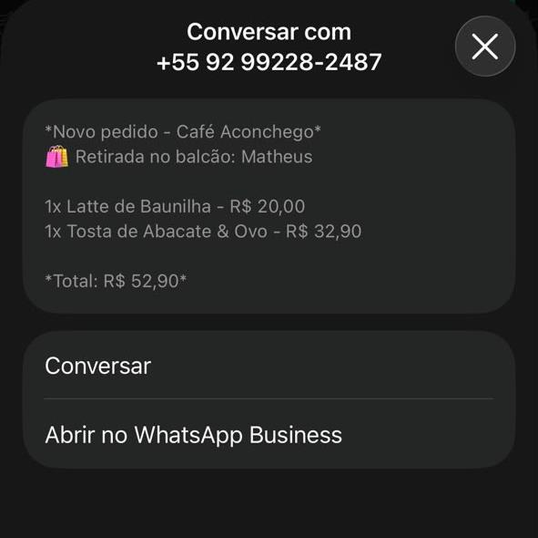

# ☕ Café Aconchego: Cardápio Digital

Cardápio digital de uma cafeteria fictícia, feito para ser aberto no celular do cliente
por QR Code. O cliente navega pelo cardápio, monta o pedido e envia pelo WhatsApp,
sem precisar instalar nada.

**🔗 Acesse a demonstração:** https://mharada7.github.io/cardapio-digital/

<p align="center">
  
  
  
</p>

## Funcionalidades

- **Cardápio com 17 itens** em 5 categorias, com foto, descrição e preço
- **Filtro por categoria** e **busca** por nome ou descrição (os dois combinados)
- **Carrinho** com quantidades (+ / −), subtotal e total, que **continua salvo** ao
  recarregar a página
- **Pedido pelo WhatsApp:** a mensagem já sai pronta, com itens, quantidades e total
- **Pedido na mesa:** o QR Code de cada mesa abre o cardápio com o número dela
  (`?mesa=4`), que vai junto no pedido
- **Retirada no balcão:** sem mesa, o cliente informa o nome antes de enviar
- Layout **mobile first**, que se adapta do celular ao computador

## Como testar

| Cenário | Link |
|---|---|
| Cliente na **mesa 4** (como se tivesse lido o QR Code da mesa) | https://mharada7.github.io/cardapio-digital/?mesa=4 |
| Cliente **sem mesa** (retirada no balcão) | https://mharada7.github.io/cardapio-digital/ |

> O botão "Enviar pedido" abre o WhatsApp de demonstração do autor. A mensagem só é
> enviada se você apertar "enviar" dentro do WhatsApp.

## Tecnologias

Feito **sem frameworks e sem etapa de build**, só com o que o navegador já entende:

- **HTML** semântico (`header`, `main`, `nav`, `dialog`) e atributos de acessibilidade
- **CSS** com variáveis, Grid, Flexbox e layout responsivo
- **JavaScript** puro: manipulação do DOM, eventos (com delegação), `filter`/`find`/`reduce`,
  `localStorage` com JSON e `URLSearchParams`
- Hospedagem gratuita no **GitHub Pages**

Cuidados de segurança: o número da mesa vindo da URL é validado (só inteiros de 1 a 99)
e nunca é inserido como HTML, o que evita ataques de XSS.

## Rodar no seu computador

1. Baixe o projeto (botão **Code → Download ZIP**) ou clone o repositório.
2. Abra a pasta no VS Code e use a extensão **Live Server** (botão direito no
   `index.html` → **Open with Live Server**).
   Também funciona abrindo o `index.html` direto no navegador.

## Adaptar para outro estabelecimento

- **Itens do cardápio:** edite o array em [`js/dados.js`](js/dados.js) e coloque as fotos
  em `img/itens/`.
- **Número do WhatsApp:** troque a constante `WHATSAPP_NUMERO` no topo de
  [`js/app.js`](js/app.js) (formato: `55` + DDD + número, só dígitos).
- **Cores e fontes:** variáveis no início de [`css/style.css`](css/style.css).

## Estrutura

```
├── index.html      # estrutura da página
├── css/style.css   # visual (seções numeradas)
├── js/dados.js     # itens do cardápio
├── js/app.js       # lógica: filtros, busca, carrinho, mesa e pedido
└── img/            # fotos dos itens, favicon e imagens do README
```

## Créditos

Fotos dos itens: [Unsplash](https://unsplash.com) (licença livre).

---

Desenvolvido por **Matheus Harada**, da [Harada Tecnologias](https://mharada7.github.io/harada-tecnologias/).
